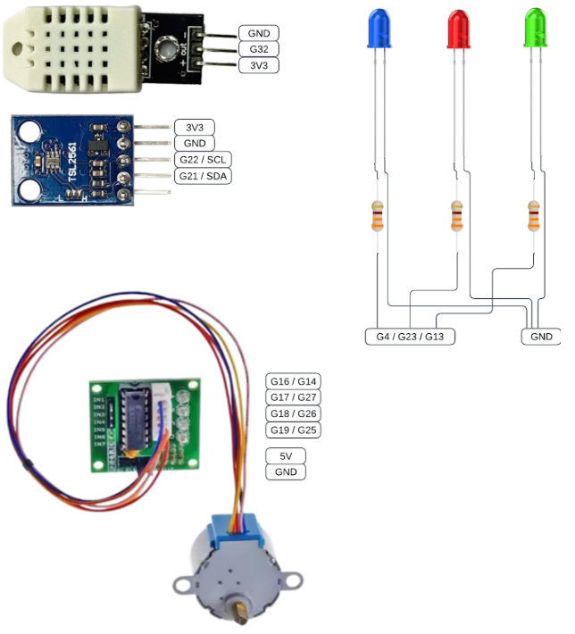
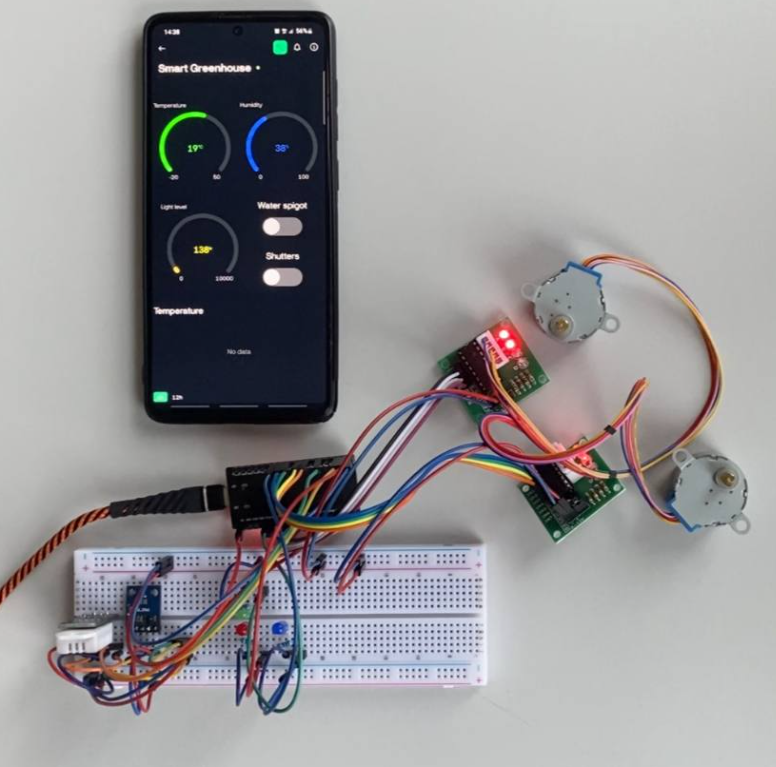
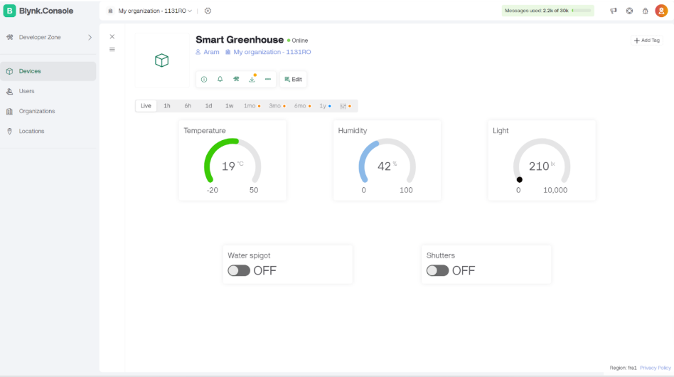
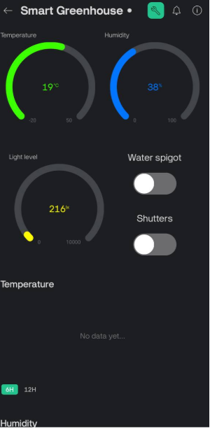

# 🌱 Intelligent Greenhouse Management System 🌱

Welcome to the Intelligent Greenhouse Management System repository! This project, developed by students at the National University "Lviv Polytechnic", showcases an embedded system designed to automate and optimize greenhouse environments. Using the powerful ESP32 microcontroller, our system monitors temperature, humidity, and light levels, and automatically adjusts conditions to ensure optimal plant growth.

## 🚀 Key Features
- **Real-time Monitoring:** Track environmental conditions with precision using DHT22 and TSL2561 sensors.
- **Automated Control:** Stepper motors manage watering and shading, maintaining ideal conditions effortlessly.
- **Remote Access:** Stay connected via Wi-Fi and Bluetooth, with full control through the Blynk IoT platform.
- **Visual Feedback:** LEDs provide instant status updates and alerts for critical conditions.

## 🔧 Hardware Setup
- **ESP32 LuaNode32 Type-C**: The core microcontroller for processing and connectivity.
- **DHT22 Sensor**: Measures temperature and humidity with high accuracy.
- **TSL2561 Sensor**: Monitors light intensity to protect plants from excessive sunlight.
- **Stepper Motors (28BYJ-48 5V DC)**: Control watering valves and shading mechanisms.
- **LEDs and 330Ω Resistors**: Provide visual status indicators.

### Pinout Diagram
The following image illustrates the ESP32 pin connections used in the project:

  

### System Scheme
The schematic below shows the wiring of all components in the system:

  

## 💻 Software and Integration
- **Arduino IDE**: Used for development, enabling easy customization of the codebase.
- **Blynk IoT Platform**: Facilitates seamless remote monitoring and control via Wi-Fi and Bluetooth.
- **Connectivity**: Supports both Wi-Fi for cloud integration and Bluetooth for local control.

### Blynk Interface
The Blynk platform provides an intuitive interface for monitoring and controlling the greenhouse. Below are screenshots of the web and mobile interfaces:

  

  

This project not only demonstrates the integration of hardware and software in an IoT context but also serves as a stepping stone for further innovation in smart agriculture. We invite you to explore the code, experiment with the setup, and contribute to enhancing its features. Together, we can cultivate smarter, more efficient greenhouses!

## 🌟 Future Plans
- Develop a custom backend to replace Blynk for greater flexibility.
- Expand sensor integration for more comprehensive environmental control.
- Optimize power consumption for extended operation.
